# Frontend Mentor - Space tourism website solution

## Table of contents

  - [The challenge](#the-challenge)
  - [Screenshot](#screenshot)
  - [Links](#links)
  - [My process](#my-process)
  - [Built with](#built-with)
  - [Continued development](#continued-development)
  - [Author](#author)

### The challenge

Users should be able to:

- View the optimal layout for each of the website's pages depending on their device's screen size
- See hover states for all interactive elements on the page
- View each page and be able to toggle between the tabs to see new information

### Screenshot

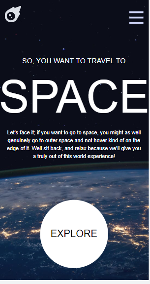
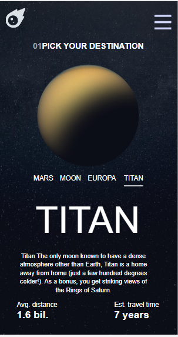
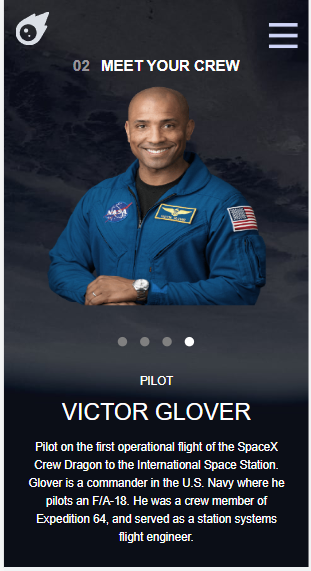
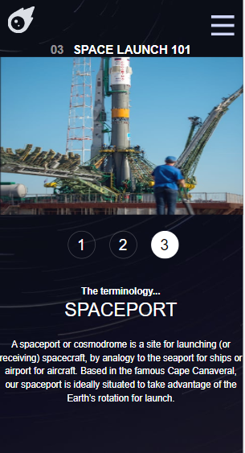
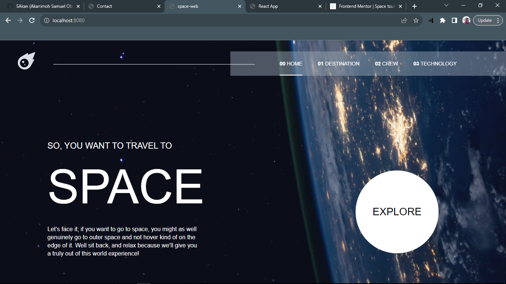
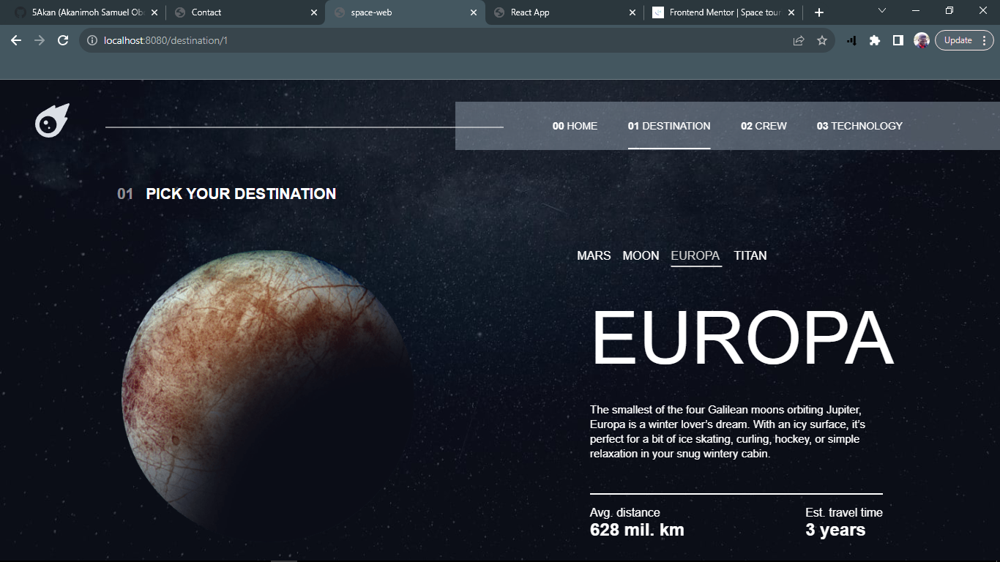
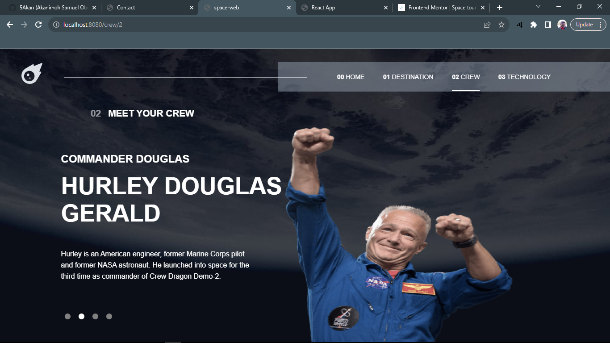
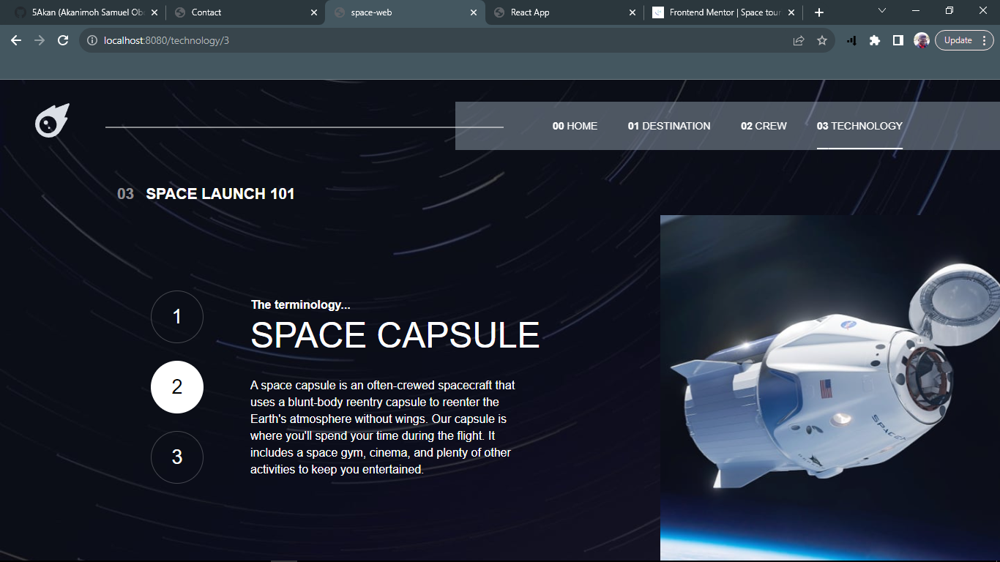
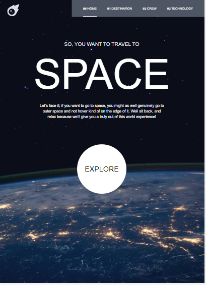
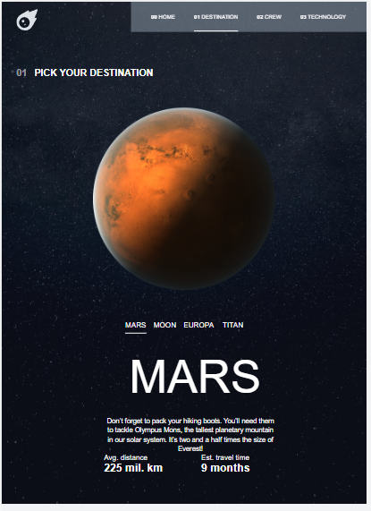
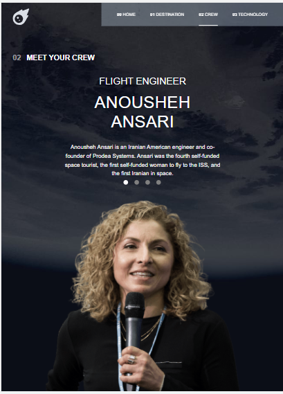
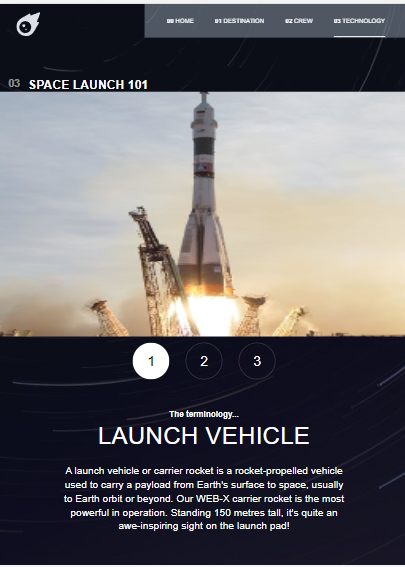

### Links

- Solution URL: [Github URL ](https://github.com/5Akan/space-web)
- Live Site URL: [From Vercel](https://ak-space-web.vercel.app/)

## My process
Series of little steps which started by putting basic html followed by vue functionalities 
I had to figure out how to toggle between divs using a function followed by dynamic classes to 
identify the divs while toggling and also the type of transitioning I wanted.
I then focused on styling based on the example given and made it responsive using @media .

### Built with

- Semantic HTML5 markup
- CSS custom properties
- @media
- [Vue](https://vuejs.org/) - JS library
- [Styled Components](https://styled-components.com/) - For styles

### Continued development

I want to seek other projects to further polish the skills I have been learning

## Author

- Frontend Mentor - [@5Akan](https://www.frontendmentor.io/profile/5Akan)
- Twitter - [@AkanimohO](https://www.twitter.com/AkanimohO)

